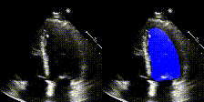
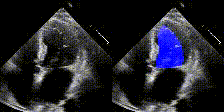
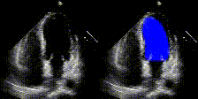
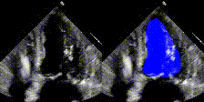
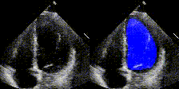
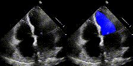

EchoNet-Dynamic-Segmentation:  Run echonet-segmentation on custom echo videos.
------------------------------------------------------------------------------

EchoNet-Dynamic is a deep learning model for semantic segmentation of the left ventricle.

For more details, see the accompanying paper,

> [**Video-based AI for beat-to-beat assessment of cardiac function**](https://www.nature.com/articles/s41586-020-2145-8) 
  David Ouyang, Bryan He, Amirata Ghorbani, Neal Yuan, Joseph Ebinger, Curt P. Langlotz, Paul A. Heidenreich, Robert A. Harrington, David H. Liang, Euan A. Ashley, and James Y. Zou. <b>Nature</b>, March 25, 2020. https://doi.org/10.1038/s41586-020-2145-8

Dataset
-------
We have used echonet dataset which consists of of 10,030 echocardiogram images which were used for training EchoNet segmentation.
Preprocessing of these images, including deidentification and conversion from DICOM format to AVI format videos, were performed with OpenCV and pydicom.
We tested the echonet-segmentation on custom mayo data. 

Examples
--------

We show examples of our semantic segmentation for nine distinct patients below.
Three patients have normal cardiac function, three have low ejection fractions, and three have arrhythmia.
No human tracings for these patients were used by EchoNet-Dynamic.

| Normal                                 | Arrhythmia                             |
| ------                                 | ----------                             |
|  |  |
|  |  |
|  |  |

Installation
------------

First, clone this repository and enter the directory by running:

    git clone https://github.com/appari/Echocardiogram-video-segmentation
    cd dynamic

EchoNet-Dynamic is implemented for Python 3, and depends on the following packages:
  - NumPy
  - PyTorch
  - Torchvision
  - OpenCV
  - skimage
  - sklearn
  - tqdm

Echonet-Dynamic and its dependencies can be installed by navigating to the cloned directory and running

    pip install --user .

Usage
-----
### Preprocessing DICOM Videos

The input of EchoNet-Dynamic is an apical-4-chamber view echocardiogram video of any length. The easiest way to run our code is to use videos from our dataset, but we also provide a Jupyter Notebook, `ConvertDICOMToAVI.ipynb`, to convert DICOM files to AVI files used for input to EchoNet-Dynamic. The Notebook deidentifies the video by cropping out information outside of the ultrasound sector, resizes the input video, and saves the video in AVI format. 

### Setting Path to Data

By default, EchoNet-Dynamic assumes that a copy of the data is saved in a folder named `a4c-video-dir/` in this directory.
This path can be changed by creating a configuration file named `echonet.cfg` (an example configuration file is `example.cfg`).

### Running Code

EchoNet-Dynamic has three main components: segmenting the left ventricle.

#### Frame-by-frame Semantic Segmentation of the Left Ventricle

    echonet segmentation --save_video
  
This creates a directory named `output/segmentation/deeplabv3_resnet50_random/`, which will contain
  - log.csv: training and validation losses
  - best.pt: checkpoint of weights for the model with the lowest validation loss
  - size.csv: estimated size of left ventricle for each frame and indicator for beginning of beat
  - videos: directory containing videos with segmentation overlay

#### Testing the segmentation
The code to preprocess the videos to convert it into videos suitable for testing the echonet-segmentation videos is availabe in the Jupyter notebook 'ConverDICOMToAVI.ipynb' in scripts folder.  
Check the following code to test echonet segmentation on custom dataset. This creates a folder 'Output_test' in the '{path}/echonet/dynamic' directory. Code to calculate dice coefficients from the output is work in progress.

    cd scripts/mayo_scripts
    python test_segmentation_mayo.py

Please edit the paths `destinationFolder`, `videosFolder` , `DestinationForWeights` and `model_name` in 'test_segmentation_mayo.py' file.

